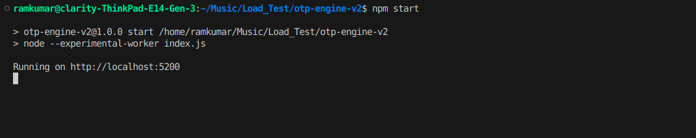
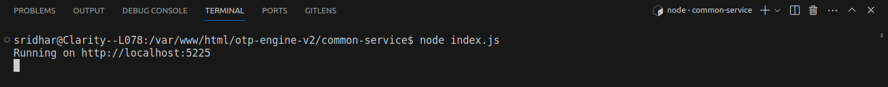
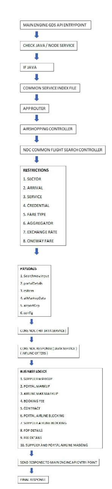

# Engine

Our application adopt a hybrid approach, where certain services of GDS of the application follows a 
monolithic architecture, while certain NDCs are built using common-services.

# Documentation

The APIs present in our application along with its sample request and response can be found in the below link:

https://developer.clarityndc.com/api-references/

# Software Prerequisites

The below listed softwares are mandatory to run our application in the local machine.

### 1. NodeJS: Minimum version -v14.x - v14.17.6

Download Link: https://nodejs.org/en/download/releases

Go to Previous Releases tab to download the recommended version


### 2. PHP: Version 8.2.0
Download Link: https://www.php.net/downloads

### 3. MAMP (For MAC systems)

Download Link: https://www.mamp.info/en/downloads/

### 4. GIT:
SignIn Link: https://gitlab.com/users/sign_in 

Credentials to git will be provided by the IT team.

### 5. MySQL:

You can use PHPMYADMIN to access the local database or you can download MySQL workbench

Download Link: https://dev.mysql.com/downloads/workbench/

### 6. WireGuard:

This will be installed by the IT team to work with VPN.

### 7. Postman:

To test the APIs use the Postman, you can download from below link.

Download Link: https://www.postman.com/downloads/

### 8. Redis:

Download as local extension in VS code

# Source Code
```
Clone the git source from following links

• OTP-UI-4 : https://gitscm.wintlt.com/OTP2/Dev/OTP-UI-4.git
• otp-engine-v2: https://gitscm.wintlt.com/OTP2/Dev/otp-engine-v2.git
• Engine_Common_Services : https://gitscm.wintlt.com/OTP2/Dev/engine_common_services
• b2b2c-Api: https://gitscm.wintlt.com/OTP2/Dev/b2b2c-Api.git
• PCI-DSS: https://gitscm.wintlt.com/PCI/PCI-DSS.git

Example:
1.Clone the otp-engine-v2 source from the git(run following command in terminal) 
$ sudo git clone https://gitscm.wintlt.com/OTP2/Dev/otp-engine-v2.git
2.Clone the Engine_Common_Services source from the git(run following command in terminal) 
$ sudo git clone https://gitscm.wintlt.com/OTP2/Dev/engine_common_services
```
# Database

Request your peers for the Database clone
• Open the mysql CLI and run the following commands(Enter password as root)

$ mysql -u root -p
$ show databases;


```
• Create database and select the newly created database

$ show databases;
$ use clarity_ndc;

```

```
$ source clarityB2B2C.sql;

Please make sure that newly created database name and development config’s database name should be same.

```


# Node-Version
```
Minimum version -v14.x - v14.17.6

Install nodejs

Install the npm pacakges with the command,
$ npm install
```
# Main engine - start

cd otp-engine-v2
npm install
node index.js



# Common Service - start

npm install
node index.js



# Environment

const flavour = 'development'; //qa, uat, prod, preprod

# Working Directory for B2B2C PHP API source
```
Linux system:

The working directory must be inside of the apache server,
Click Start Button=>Other Locations=>Computer=>var=>www=>html

Mac system:

You need to install MAMP, and the application folder should be inside the MAMP server,
/Users/sridhar/Applications/MAMP/htdocs/b2b2c-Api
```
# Working Directory for PCI-DSS source
```
Linux system:

The working directory must be inside of the apache server,
Click Start Button=>Other Locations=>Computer=>var=>www=>html

Mac system:

You need to install MAMP, and the application folder should be inside the MAMP server,
/Users/sridhar/Applications/MAMP/htdocs/PCI-DSS
```
# OTP-UI-4 source

Change App environment from stg to local in .env file (/var/www/html/OTP-UI-4/.env)


Build the project by using the command npm run build
Run the project by using the command npm run start


# Common Service Workflow

